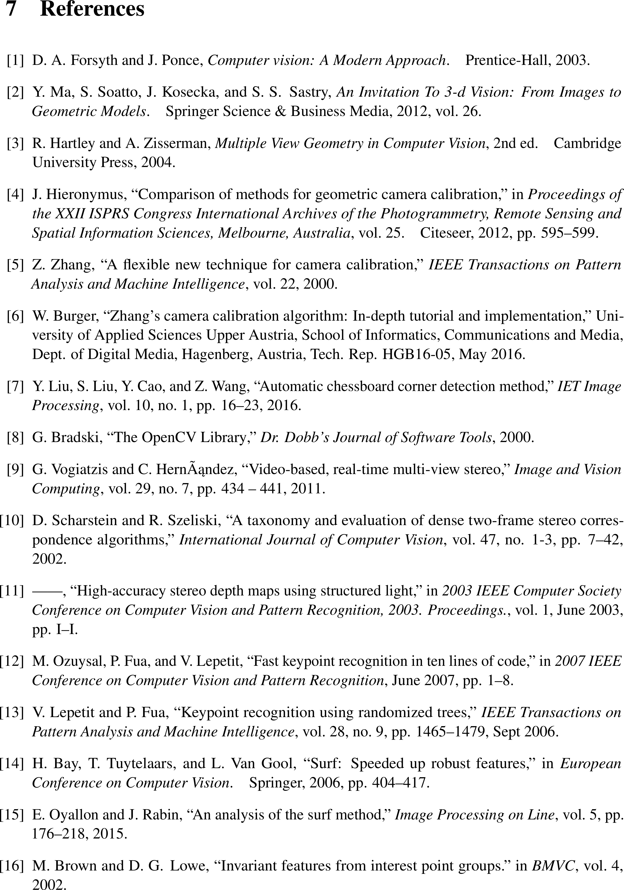

# Sparce Feature-Based Reconstruction

> Reconstruct key points in a scene from multiple images using feature-based techniques.

The FURN and SURF feature descriptors (from OpenCV) are used to match keypoints across multiple images. These are then reprojected into 3D space with the use of both the camera intrinsic and extrinsic information.

---

## Table of Contents

- [Installation](#installation)
- [Usage](#usage)
- [Documentation](#documentation)
- [Disclamer](#disclamer)

---

## Installation

- Install python
- Install various depencancies such as numpy ( requirements.txt to come )
- Run the code

## Usage

- Coming soon

## Documentation

---

## Disclamer

This repository is for educational purposes only. The algorithms implemented here is my interpretation of the original authors' work. Due to this, they will most likely not produce the same results as the original implementations. All rights are reserved to the original authors of the papers this code was based on. 

